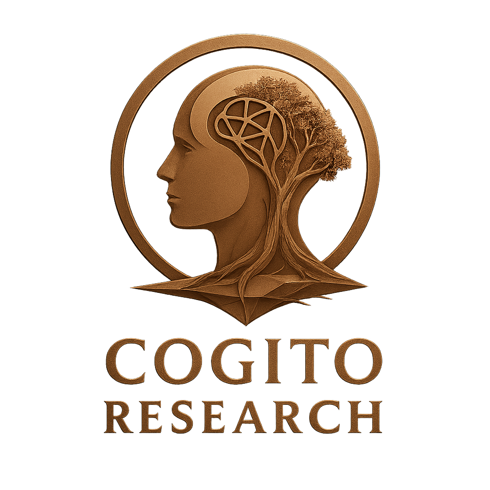
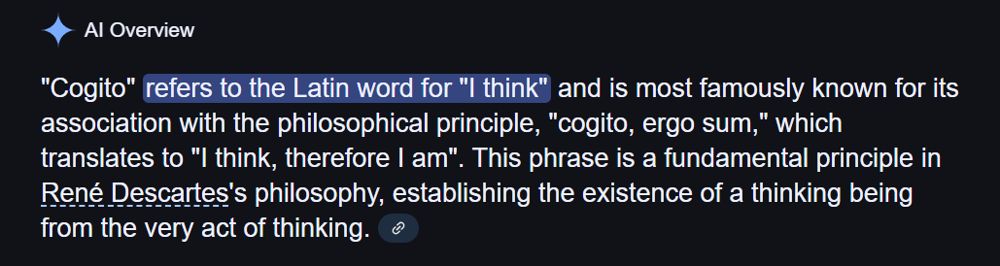
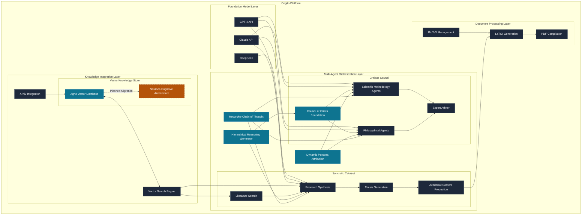

<h1 align="center">Cogito: It's Time to Revolutionize Research with AI</h1>

<p align="center">
  
</p>

<p align="center">
  
  
</p>

<p align="center">
  <em>A significant AI research platform that dramatically accelerates your pursuit of knowledge synthesis, critique, and discovery.</em>
</p>

<p align="center">
  <a href="#what-is-cogito">Overview</a> |
  <a href="#how-to-use-cogito">Usage</a> |
  <a href="#technical-foundation">Technology</a> |
  <a href="#system-architecture">Architecture</a> |
  <a href="#realistic-expectations">Limitations</a> |
  <a href="#getting-started">Get Started</a>
</p>

<h2 align="center">What is Cogito?</h2>

<p align="center">
  Cogito is a powerful AI research platform that provides rigorous assistance in the scholarly process across disciplines. A leap above mainstream deep-research frameworks. It fundamentally transforms how research can be conducted by combining advanced multi-agent AI systems with direct access to scientific literature through ArXiv integration and the Agno knowledge base. Cogito doesn't just summarize or organize existing knowledge—it <strong>performs real research</strong> by autonomously searching, retrieving, and analyzing primary scientific literature across the ArXiv database of over 2 million scholarly articles.
</p>

<p align="center">
  Unlike conventional research tools that simply help organize or search through existing information, Cogito actively <strong>participates in the intellectual process</strong> - analyzing concepts across historical and contemporary literature, identifying methodological approaches, developing mathematical formalizations, evaluating empirical evidence, and synthesizing novel insights. Each agent in the system ruthlessly critiques not only the subject matter but also its own work and the work of other agents, pursuing truth with unwavering intellectual rigor.
</p>

<p align="center">
  
</p>

## Why Cogito Transforms Research

### The Truth-Seeking Engine

At its core, Cogito is designed to pursue truth with relentless determination:

- **Real Scientific Research**: Directly accesses and analyzes millions of primary research papers from ArXiv
- **Self-Critiquing Agents**: Each agent continuously evaluates and improves its own outputs
- **Peer Verification**: Multiple specialized agents verify each other's work from different perspectives
- **Evidence-Based Reasoning**: Every claim must be supported by empirical evidence or rigorous logical derivation
- **Meticulous Standard Enforcement**: The system demands academic excellence at every step of the process

### 10x Acceleration of Scientific Workflows

Traditional academic research requires months of literature review, critical analysis, and scholarly writing. Cogito compresses this timeline dramatically:

- **Literature Synthesis**: Analyze hundreds of relevant papers across decades of research in minutes instead of months
- **Critical Evaluation**: Apply rigorous philosophical and scientific frameworks automatically
- **Gap Identification**: Discover overlooked research opportunities across disciplinary boundaries
- **Novel Connection Discovery**: Identify non-obvious links between disparate research domains
- **Complete Publications**: Generate formal academic documents with proper citations, methodologies, and evidence

### Dual System Architecture

Cogito consists of two complementary systems powered by state-of-the-art AI that work together to both critique existing knowledge and synthesize new insights:

#### 1. Critique Council

A multi-agent AI system that subjects concepts to ruthlessly rigorous intellectual evaluation:

- **Philosophical Analysis**: Applies the analytical frameworks of major philosophical traditions (Aristotle, Descartes, Kant, Leibniz, Popper, Russell)
- **Scientific Peer Review**: Conducts domain-specific scientific evaluation with academic rigor
- **Arbitration Process**: Resolves contradictions and assigns confidence scores to different critiques
- **Publication-Quality Output**: Produces comprehensive critique reports and formal peer reviews

#### 2. Syncretic Catalyst

A research synthesis engine that constructs new academic knowledge:

- **Vector-Powered Literature Discovery**: Finds semantically relevant work across ArXiv's repository using advanced vector embeddings
- **Multi-Agent Research Team**: Specialized research agents explore different dimensions of a concept:
  - **Historical Development**: Uncovers foundational and overlooked historical research
  - **Modern Research Landscape**: Analyzes cutting-edge developments and current gaps
  - **Methodological Approaches**: Develops rigorous validation techniques
  - **Mathematical Formalization**: Creates formal representations and models
  - **Empirical Evidence**: Gathers and evaluates supporting evidence
  - **Interdisciplinary Connections**: Identifies cross-domain applications
  - **Implications & Applications**: Explores broader impact and future directions
- **Comprehensive Thesis Construction**: Synthesizes a cohesive academic thesis with proper citations

## What Makes Cogito Unique

### True Research vs. Summarization

Unlike typical AI tools that merely summarize or paraphrase information from their training data, Cogito:

1. **Directly accesses primary scientific literature** through ArXiv integration and the Agno knowledge library
2. **Retrieves and analyzes specific papers** relevant to the research question
3. **Verifies information against original sources** rather than relying on pre-trained knowledge
4. **Enforces academic standards** through rigorous self-critique and peer verification
5. **Pursues methodological excellence** by challenging its own assumptions and conclusions

This approach produces genuinely novel insights backed by real scientific evidence, not mere recombinations of pre-existing knowledge.

### Comparison with Other Research Tools

| Capability | Traditional Research Tools | Large Language Models | **Cogito** |
|------------|----------------------------|----------------------|------------|
| Literature Search | Limited keyword search | Broad but limited to training data | **Semantic vector search across historical and modern papers** |
| Multi-Perspective Analysis | Manual consultation of different viewpoints | Single perspective with limited depth | **Specialized agents with distinct philosophical and scientific perspectives** |
| Critical Evaluation | Manual, subjective | Simplistic, without methodological rigor | **Structured critique with recursive reasoning and arbitration** |
| Academic Rigor | Dependent on researcher | Variable quality, hallucinations | **Formal academic standards with proper citation and evidence** |
| Novel Insights | Limited by researcher's knowledge | Primarily recombination of existing knowledge | **Identification of unexplored areas and novel connections across domains** |
| Mathematical Formalization | Manual development | Limited capability | **Sophisticated formalization with appropriate notation and proofs** |
| Output Format | Requires manual formatting | Basic formatting | **Publication-ready academic papers and formal peer reviews** |

### Example: AI-Generated Academic Peer Review

Cogito produces formal peer reviews indistinguishable from those written by human academics—but backed by comprehensive literature review of actual scientific papers. These reviews include:

- Credentials and expertise relevant to the subject matter
- Comprehensive analysis of methodological rigor
- Evaluation of theoretical foundations and empirical evidence
- Specific, actionable recommendations for improvement
- Proper academic tone and formatting

[View Example Peer Review (PDF)](latex_output/review.pdf) - See a real example of a formal academic peer review generated by Cogito

### Example: Comprehensive Thesis Development

Starting with just a simple concept or hypothesis, Cogito meticulously researches and develops academic work by:

1. Retrieving and analyzing actual papers from ArXiv spanning decades of relevant research
2. Mapping the intellectual landscape to identify genuine research gaps and opportunities
3. Developing appropriate methodological approaches and rigorous mathematical formalizations
4. Gathering and critically evaluating empirical evidence from primary sources
5. Constructing a comprehensive academic thesis with proper citations to real scientific literature
6. Generating publication-ready documents that meet the highest academic standards

## Technical Foundation

Cogito builds on several pioneering technologies to achieve its transformative capabilities:

- **Large Language Models**: Leverages state-of-the-art LLMs from Anthropic (Claude) and OpenAI (GPT-4) orchestrated in a multi-agent architecture
- **ArXiv Integration**: Direct access to over 2 million scholarly articles across scientific disciplines through the ArXiv API
- **Hierarchical Reasoning Generator**: Revolutionary approach to AI planning and reasoning that transcends traditional flat reasoning patterns by decomposing complex cognitive tasks into a hierarchical Phase → Task → Step structure ([GitHub](https://github.com/justinlietz93/hierarchical_reasoning_generator))
- **Dynamic Persona Attribution**: Creative and potent strategy for generating domain-specialized AI personas that adapt to complex knowledge domains, integrating philosophical frameworks with scientific expertise ([GitHub](https://github.com/justinlietz93/hierarchical_reasoning_generator/tree/main/hierarchical_planner/persona_builder))
- **Council of Critics**: The pioneering multi-agent architecture that evolved into the current Critique Council, providing the foundational framework for multi-perspective evaluation
- **Recursive Chain of Thought (RCoT)**: Advanced reasoning mechanism enabling iterative refinement within agents, creating a continuous self-learning loop for ever-improving performance ([GitHub](https://github.com/justinlietz93/RCoT))
- **Agno Knowledge Base**: Sophisticated vector database technology for semantic understanding of research (to be replaced with Neuroca)
- **Neuroca**: Next-generation biologically-inspired NeuroCognitive Architecture implementing tiered memory, health dynamics (energy, focus), and simulated neurological processes for more human-like reasoning ([GitHub](https://github.com/Modern-Prometheus-AI/Neuroca))
- **Vector-Based Search**: Advanced semantic search using high-dimensional vector embeddings (with both OpenAI and local fallback options)
- **Self-Critique Mechanisms**: Recursive evaluation and improvement processes
- **Academic Standard Enforcement**: Rigorous validation against established scientific norms

## System Architecture

The Cogito platform is built on a sophisticated, modular architecture that integrates multiple advanced AI technologies:



### Key Architectural Components

#### 1. Hierarchical Reasoning Generator

The Hierarchical Reasoning Generator represents a fundamental shift in how AI systems organize complex cognitive tasks, mirroring human expert problem-solving patterns. This groundbreaking approach:

- Transcends traditional flat reasoning by decomposing high-level goals into a structured Phase → Task → Step hierarchy
- Enables truly scalable reasoning across arbitrary complexity levels
- Creates both top-down strategic thinking and bottom-up tactical execution
- Forms the cognitive backbone for both the Critique Council and Syncretic Catalyst subsystems

The hierarchical structure provides Cogito with the unique ability to approach research problems at multiple levels of abstraction simultaneously - from broad disciplinary frameworks down to specific methodological details.

#### 2. Dynamic Persona Attribution

This revolutionary advancement in contextual AI adaptation transforms generic LLMs into domain-specialized expert personas:

- Generates sophisticated academic personas with appropriate credentials and domain specialization
- Dynamically adapts reasoning frameworks based on both philosophical tradition and scientific domain
- Creates coherent, consistent expert perspectives for more nuanced multi-agent debate
- Ensures that critiques and research contributions maintain appropriate academic voice and expertise

The persona system enables each agent to maintain a consistent intellectual framework while specializing in the specific domain required by the research task.

#### 3. Recursive Chain of Thought (RCoT)

The RCoT architecture enables a powerful form of self-improving AI reasoning:

- Implements iterative refinement loops within each reasoning agent
- Orchestrates multiple specialized AI agents working in parallel
- Aggregates results via sophisticated consensus mechanisms
- Incorporates robust self-learning through continuous performance evaluation and adjustment

This creates a continuous improvement cycle, where each agent not only contributes to the research process but also evolves its own capabilities through structured self-critique.

#### 4. Council of Critics to Critique Council Evolution

The original Council of Critics provided the conceptual foundation that evolved into the current Critique Council:

- Pioneered the multi-perspective critical analysis approach
- Established the philosophical foundation for rigorous intellectual evaluation
- Introduced the concept of confidence-weighted critique aggregation
- Evolved into the more sophisticated arbitration-based system in the current implementation

This evolution represents the development of increasingly sophisticated multi-agent debate and consensus systems.

#### 5. Neuroca (Future Agno Replacement)

The planned migration from Agno to Neuroca will introduce a biologically-inspired NeuroCognitive Architecture that:

- Implements tiered memory systems mirroring human cognitive processes
- Introduces dynamic health systems (energy, focus) for more realistic cognitive resource management
- Simulates neurological processes for more human-like reasoning and adaptability
- Provides more sophisticated knowledge representation and retrieval mechanisms

This advancement will significantly enhance Cogito's ability to maintain complex research context and make more nuanced connections between disparate concepts.

## Vector Search Details

The semantic search capabilities work as follows:

- **Pre-indexed Corpus**: ArXiv papers are indexed on-demand through the ArXiv API, with results cached locally
- **Vector Database**: Papers are converted to vector embeddings (using OpenAI embeddings when available, with local fallback)
- **Semantic Matching**: Search uses cosine similarity between content vectors and paper vectors
- **Dynamic Discovery**: New papers are discovered during research and automatically added to the local vector database
- **Flexible Configuration**: Can work entirely offline with local embedding generation if API keys aren't available 

## How to Use Cogito

Cogito offers multiple ways to accelerate your research with truth-seeking rigor:

### For Critical Analysis

```bash
# Generate a comprehensive philosophical and scientific critique
python run_critique.py your_document.txt --scientific

# Produce a formal academic peer review
python run_critique.py your_document.txt --scientific --PR

# Generate publication-ready LaTeX output
python run_critique.py your_document.txt --scientific --PR --latex
```

### For Research Synthesis

```bash
# Build a comprehensive thesis from a concept
python src/syncretic_catalyst/thesis_builder.py "Your research concept or hypothesis"

# Enhance an existing research project with semantic literature search
python src/syncretic_catalyst/research_enhancer.py
```

## What Cogito Produces

### Critical Analysis Outputs

- **Comprehensive Critique Reports**: Multi-perspective analysis with confidence scores
- **Formal Peer Reviews**: Academic peer reviews following publication standards
- **Publication-Ready Documents**: LaTeX and PDF outputs with proper formatting, citations, and structure

### Research Synthesis Outputs

- **Comprehensive Academic Theses**: Complete research papers with proper citations
- **Research Gap Analyses**: Identification of unexplored areas and opportunities
- **Literature Maps**: Organized collections of relevant papers across time and disciplines
- **Novel Connection Reports**: Analysis of cross-disciplinary applications

## Realistic Expectations

While Cogito significantly accelerates research workflows, it's important to understand:

### What "Publication-Ready" Means

- **Formatting**: Documents follow proper academic format with citations, sections, and LaTeX integration
- **Content Quality**: High-quality academic writing that requires human review before submission
- **Human Partnership**: Cogito is designed to enhance human researchers, not replace them

### Current Limitations

- **Domain Expertise**: While the system has broad knowledge, it cannot match the depth of specialized human experts in niche fields
- **Novel Experiments**: Cogito can suggest experimental designs but cannot perform physical laboratory work
- **Validation Requirements**: Output should be validated by human researchers before use in critical applications
- **API Dependencies**: Full functionality requires API access to LLM providers (fallback mechanisms are available)
- **ArXiv Scope**: Literature access is currently limited to papers available in the ArXiv repository

## Known Issues

The current version of Cogito has several known issues that we're actively working to address:

- **LaTeX Compilation Environment**: Requires proper LaTeX installation with Perl for PDF generation
- **API Rate Limiting**: Heavy usage may encounter rate limits with OpenAI and Anthropic APIs
- **Memory Usage**: The vector database can consume significant memory with very large research projects
- **Windows Path Handling**: Some Windows systems may require path adjustments for proper file access
- **Long-Running Operations**: Complex research tasks may time out during extended processing
- **Citation Formatting**: Certain non-standard citation formats may not render correctly

Workarounds for these issues are documented in the [Troubleshooting Guide](docs/troubleshooting.md).

## Future Enhancements Coming Soon

We're actively developing the following enhancements for upcoming releases:

### Expanding Research Capabilities
- **Additional Scientific Databases**: Integration with PubMed, IEEE Xplore, and other scholarly repositories
- **Improved Mathematical Reasoning**: Enhanced capabilities for complex mathematical derivation and proof
- **Research Visualization Tools**: Interactive visualizations of research connections and knowledge graphs
- **Custom Knowledge Bases**: Support for organization-specific or private research repositories

### Architecture Improvements
- **Full Neuroca Integration**: Complete migration from Agno to the Neuroca cognitive architecture
- **Enhanced RCoT Implementation**: Further development of recursive reasoning capabilities
- **Distributed Processing**: Support for handling very large research projects
- **Collaborative Workflows**: Multi-user research environments with shared knowledge
- **API Interface**: Programmatic access for integration with other research tools

### Enhanced Output Options
- **Interactive Document Formats**: HTML outputs with interactive elements and visualizations
- **Presentation Generation**: Creation of research presentations and posters
- **Domain-Specific Templates**: Specialized formats for different academic fields and journals
- **Multilingual Support**: Research synthesis and critique in multiple languages

## Integration with Research Workflows

Cogito is designed to integrate with existing research processes:

1. **Initial Exploration**: Use Cogito to rapidly explore research areas and identify promising directions
2. **Literature Review Acceleration**: Let Cogito discover and synthesize relevant literature
3. **Critical Evaluation**: Apply rigorous critique to existing work or preliminary ideas
4. **Draft Generation**: Create structured academic drafts with proper citations
5. **Human Refinement**: Review, validate, and refine the output
6. **Iteration**: Update and enhance the work with additional Cogito-powered analysis

This human-AI collaborative workflow maintains scientific integrity while dramatically increasing research velocity.

## Getting Started

### Installation

```bash
# Clone the repository
git clone https://github.com/yourusername/cogito.git
cd cogito

# Install dependencies
pip install -r requirements.txt

# Set up API keys in .env file
echo "ANTHROPIC_API_KEY=your_key_here" > .env
echo "OPENAI_API_KEY=your_key_here" >> .env
```

### Quick Start

```bash
# Run a critique with scientific peer review
python run_critique.py sample_content.txt --scientific --PR

# Generate a thesis on quantum computing
python src/syncretic_catalyst/thesis_builder.py "Quantum computation applied to climate modeling"
```

## Learn More

- [Documentation](docs/)
- [Example Outputs](examples/)
- [Configuration Guide](docs/configuration.md)
- [API Reference](docs/api_reference.md)
- [Cogito Knowledge Base](https://notebooklm.google.com/notebook/55d7ef7a-e0e7-4e83-99de-2ee0106c822e) - Send an email to jlietz93@gmail.com to gain private access to the NotebookLM knowledgebase where you can ask questions directly about the repository and technologies

## License

This project is licensed under the MIT License - see the [LICENSE](LICENSE) file for details.
