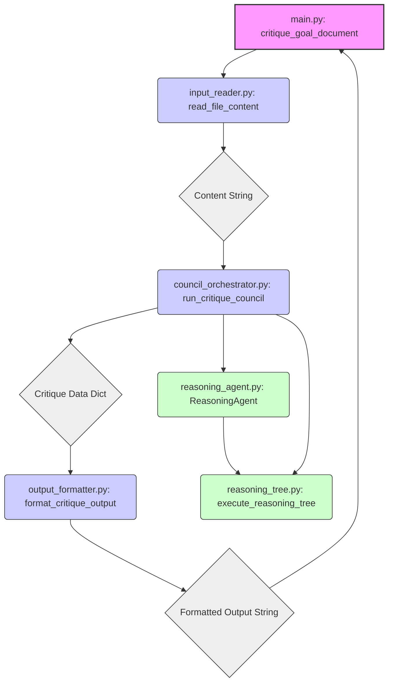

# Design Specification: Reasoning Council Critique Module

**Version:** 1.0
**Date:** 2025-04-06

## 1. Introduction

This document details the design for the Reasoning Council Critique Module, fulfilling the requirements outlined in `docs/critique_module_requirements.md`. The module analyzes text content using a multi-agent reasoning council approach.

## 2. High-Level Architecture

The module follows a decoupled, component-based architecture. The primary workflow is orchestrated by a main function that utilizes distinct components for input reading, council execution, and output formatting.



## 3. Core Module Interface

The primary entry point will be a function within `src/main.py` (relative to the critique_council/src directory):

```python
def critique_goal_document(file_path: str) -> str:
    """
    Reads content from the specified file, runs the Reasoning Council critique,
    and returns a formatted, objective assessment string.

    Args:
        file_path: Path to the input text file (e.g., 'goal.txt').

    Returns:
        A string containing the final formatted critique or a "no significant findings" message.

    Raises:
        FileNotFoundError: If the input file_path does not exist.
        IOError: If the file cannot be read.
        Exception: For unexpected errors during critique processing.
    """
    # 1. Read Input
    # 2. Run Council
    # 3. Format Output
    pass
```

## 4. Component Design

### 4.1. Input Reader (`input_reader.py`)

*   **Purpose:** Reads content from the specified file path.
*   **Interface:**
    ```python
    def read_file_content(file_path: str) -> str:
        """Reads and returns the content of a text file."""
        pass
    ```
*   **Error Handling:** Must handle `FileNotFoundError` and general `IOError`.

### 4.2. Council Orchestrator (`council_orchestrator.py`)

*   **Purpose:** Manages the lifecycle of the Reasoning Council, including agent instantiation, critique rounds, self-critique, and final synthesis.
*   **Interface:**
    ```python
    def run_critique_council(content: str) -> dict:
        """
        Orchestrates the reasoning council critique process.

        Args:
            content: The text content to be critiqued.

        Returns:
            A dictionary containing the synthesized critique data.
            Example: {'final_assessment': '...', 'points': [], 'no_findings': bool}
        """
        # 1. Instantiate Agents
        # 2. Initial Critique Round
        # 3. Self-Critique Round
        # 4. Synthesize Results
        pass
    ```
*   **Dependencies:** `ReasoningAgent` implementations, `reasoning_tree` logic.

### 4.3. Reasoning Agent (`reasoning_agent.py`)

*   **Purpose:** Defines the interface and implements specific reasoning agents with unique styles.
*   **Base Interface (Conceptual):**
    ```python
    class ReasoningAgent:
        def __init__(self, style_name: str):
            self.style = style_name

        def critique(self, content: str) -> dict:
            """Generates an initial critique using the agent's style and reasoning tree."""
            # Calls reasoning_tree.execute_reasoning_tree
            pass

        def self_critique(self, own_critique: dict, other_critiques: list[dict]) -> dict:
            """Performs self-critique based on own and others' assessments."""
            # Calls reasoning_tree.execute_reasoning_tree (potentially)
            pass
    ```
*   **Concrete Implementations:** E.g., `AristotleAgent(PhilosopherAgent)`, `DescartesAgent(PhilosopherAgent)`, etc. Loads directives from `prompts/` directory.

### 4.4. Reasoning Tree (`reasoning_tree.py`)

*   **Purpose:** Implements the recursive logic for generating detailed critiques.
*   **Interface (Conceptual):**
    ```python
    def execute_reasoning_tree(prompt: str, initial_content: str, style_directives: str, depth: int = 0, max_depth: int = 3) -> dict:
        """
        Recursively generates a critique tree based on prompts and content.

        Args:
            prompt: The specific prompt for this reasoning step.
            initial_content: The content being analyzed at this level.
            style_directives: Instructions defining the agent's reasoning style.
            depth: Current recursion depth.
            max_depth: Maximum recursion depth.

        Returns:
            A dictionary representing the critique (sub)tree.
            Example: {'claim': '...', 'evidence': '...', 'confidence': 0.8, 'sub_critiques': []}
        """
        # 1. Base Case Check (depth, confidence, etc.)
        # 2. Generate assessment at this level (e.g., call LLM)
        # 3. Identify sub-points for deeper critique
        # 4. Recursively call execute_reasoning_tree for sub-points
        # 5. Aggregate results
        pass
    ```
*   **Note:** The current implementation uses placeholder logic.

### 4.5. Output Formatter (`output_formatter.py`)

*   **Purpose:** Formats the final synthesized critique data into the required objective, robotic string output.
*   **Interface:**
    ```python
    def format_critique_output(critique_data: dict) -> str:
        """
        Formats the synthesized critique data into a final string.

        Args:
            critique_data: Dictionary from the council orchestrator.
                           Example: {'final_assessment': '...', 'points': [], 'no_findings': bool}

        Returns:
            A formatted string adhering to the objective/robotic tone requirement.
        """
        # 1. Check 'no_findings' flag
        # 2. Format 'final_assessment' and 'points' objectively
        pass
    ```

## 5. Data Structures

*   **Content:** `str` (Plain text content from the input file).
*   **Initial Critique (Agent Output):** `dict` (Example: `{'agent_style': 'Aristotle', 'critique_tree': {'id': '...', 'claim': '...', 'sub_critiques': [...]}}`)
*   **Self-Critique Input (To Agent):** `dict` (Example: `{'own_critique': {...}, 'other_critiques': [...]}`)
*   **Self-Critique Output (Agent Output):** `dict` (Example: `{'agent_style': 'Aristotle', 'adjustments': [{'target_claim_id': '...', 'confidence_delta': -0.1, 'reasoning': '...'}]}`)
*   **Synthesized Critique Data (Orchestrator Output):** `dict` (Example: `{'final_assessment': 'Overall assessment summary.', 'points': [{'area': 'Clarity', 'critique': 'Section 2 lacks precision.', 'severity': 'Medium', 'confidence': 0.75}, ...], 'no_findings': False}`)
*   **Final Output:** `str` (Formatted text).

## 6. Reasoning Council Architecture

### 6.1. Agent Personas & Philosophies

The council will consist of agents embodying the philosophies of specific thinkers, using directives loaded from the `prompts/` directory (expected sibling to `src/`). The goal is a meticulous critique based on each philosopher's core principles.

*   **Aristotle:** Focuses on teleology (purpose), causality (four causes), logic (syllogisms), empirical observation, and categorization. Heuristic: *Analyze purpose, logical structure, empirical grounding, and classification.* (Uses `prompts/critique_aristotle.txt`)
*   **Descartes:** Employs radical doubt, seeks clear and distinct ideas, emphasizes rationalism and foundationalism. Heuristic: *Apply methodical doubt, seek indubitable foundations, analyze clarity and distinctness.* (Uses `prompts/critique_descartes.txt`)
*   **Kant:** Examines preconditions of understanding (categories, forms of intuition), distinguishes analytic/synthetic judgments, focuses on universalizability and duty (ethics). Heuristic: *Analyze underlying structure of arguments, consistency with universal principles, clarity of concepts.* (Uses `prompts/critique_kant.txt`)
*   **Leibniz:** Focuses on the principle of sufficient reason, monadology, optimism (best possible world), and logical calculus. Heuristic: *Seek underlying reasons, analyze internal consistency and completeness, evaluate optimality of structure/argument.* (Uses `prompts/critique_leibniz.txt`)
*   **Popper:** Emphasizes falsifiability, critical rationalism, and the demarcation problem. Heuristic: *Assess claims for falsifiability, identify potential refutations, analyze clarity and testability.* (Uses `prompts/critique_popper.txt`)
*   **Russell:** Focuses on logical atomism, analytic philosophy, clarity of language, and avoidance of paradox. Heuristic: *Analyze propositions into simplest components, evaluate linguistic precision, check for logical contradictions.* (Uses `prompts/critique_russell.txt`)

### 6.2. Interaction Flow

1.  **Initialization:** The `CouncilOrchestrator` instantiates one agent for each defined philosopher class.
2.  **Initial Critique Distribution:** The orchestrator sends the input `content` to the `critique` method of each agent.
3.  **Initial Critique Generation:** Each agent independently generates its critique using its specific style (loading directives from its file) and the recursive reasoning tree logic, returning an `Initial Critique` data structure.
4.  **Critique Collation:** The orchestrator collects all `Initial Critique` structures.
5.  **Self-Critique Distribution:** The orchestrator calls the `self_critique` method of each agent, providing the agent's own `Initial Critique` and a list of the `Initial Critique` structures from all other agents.
6.  **Self-Critique Generation:** Each agent analyzes its own critique in light of the others, applying its reasoning style to identify potential biases, missed points, or areas needing adjustment. It returns a `Self-Critique Output` structure detailing proposed adjustments.
7.  **Critique Synthesis:** The orchestrator collects all `Self-Critique Output`. It then synthesizes a final assessment by potentially adjusting confidence scores or claims in the initial critiques based on the self-critique adjustments, resolving conflicts, and summarizing key findings. This produces the `Synthesized Critique Data`.

### 6.3. Data Formats (Refinement)

*   **Initial Critique (Agent Output):** `dict` - `{'agent_style': str, 'critique_tree': dict}` (Tree structure defined in Section 7)
*   **Self-Critique Output (Agent Output):** `dict` - `{'agent_style': str, 'adjustments': list[dict]}` (Example `adjustments` list item: `{'target_claim_id': str, 'confidence_delta': float, 'reasoning': str}`)

## 7. Recursive Reasoning Tree Logic

### 7.1. Node Structure

Each node in the reasoning tree represents a specific critique point and follows this conceptual structure:

```python
{
    'id': str,          # Unique identifier for the node/claim (e.g., UUID)
    'claim': str,       # The specific critique point or assertion being made.
    'evidence': str,    # Supporting text snippet from the input or reasoning steps.
    'confidence': float,# Agent's confidence in this claim (0.0-1.0).
    'severity': str,    # Estimated impact (e.g., 'Low', 'Medium', 'High', 'Critical') - Optional.
    'sub_critiques': list[dict] # List of child nodes representing deeper critiques of this claim.
}
```

### 7.2. Recursive Process (`execute_reasoning_tree` conceptual logic)

The core function responsible for generating the critique tree operates recursively:

1.  **Input:** Receives the content segment to analyze (`current_content`), agent `style_directives`, current `depth`, and `max_depth`.
2.  **Base Case Check:** Terminate recursion and return `None` or a minimal node if:
    *   `depth >= max_depth`.
    *   `current_content` is too small/atomic for further decomposition.
    *   A preliminary assessment yields very low confidence.
3.  **Node Assessment:** Prompt the underlying reasoning mechanism (e.g., LLM) using `current_content` and `style_directives` to:
    *   Generate the primary `claim` for this node.
    *   Identify supporting `evidence` within `current_content`.
    *   Estimate `confidence` (0.0-1.0).
    *   Optionally estimate `severity`.
    *   Assign a unique `id`.
4.  **Decomposition Identification:** Prompt the reasoning mechanism (or use analytical methods) to identify specific sub-sections, arguments, or topics within `current_content` that are relevant to the current `claim` and require deeper analysis.
5.  **Recursive Calls:** For each identified sub-point:
    *   Extract the relevant sub-content.
    *   Recursively call `execute_reasoning_tree` with the sub-content, `style_directives`, `depth + 1`, and `max_depth`.
6.  **Aggregation:** Collect the valid dictionary results (child nodes) from the recursive calls.
7.  **Node Construction:** Create the current node dictionary, populating `sub_critiques` with the aggregated child nodes.
8.  **Refinement (Optional):** The reasoning mechanism could potentially adjust the current node's `claim`, `confidence`, or `severity` based on the findings in the `sub_critiques`.
9.  **Return:** Return the constructed node dictionary.

### 7.3. Termination Conditions

Recursion for a branch terminates when:

*   The maximum depth (`max_depth`, e.g., 3) is reached.
*   The content segment is deemed too small or atomic for meaningful further critique.
*   The confidence score for a potential critique point falls below a predefined threshold (e.g., 0.3).
*   The reasoning mechanism explicitly indicates that no further valuable decomposition or refinement is possible for that branch.

## 8. Error Handling Strategy

*   File I/O errors will be handled in the `input_reader` and propagated.
*   Errors during council execution (e.g., LLM API failures, unexpected data) should be caught by the `council_orchestrator` and potentially logged, returning an error state or raising an exception.
*   The main `critique_goal_document` function should include a top-level try/except block to catch and report unexpected errors.

## 9. Compliance Notes

*   Adherence to Apex Standards (Rule #4, #8, #18) is paramount in implementation.
*   Modularity is enforced by separating concerns into distinct Python files/components.
*   The 500-line limit per file (Rule #8: QUAL-SIZE) will be monitored during implementation.
